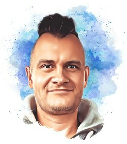

## Marc Gerrit Langer

  

Hallo, my name is Marc.

I live in Brandenburg in Germany, near Berlin.

I am a happy father, tech and science nerd, feminist, <a href="https://revolvermann76.github.io/marc-gerrit-artist/">artist</a> and treasure hunter.

I am concerned about human rights, animal rights, climate change and a lot more.

I try to make that world each day a better place, than the day before.
  

## some facts about me

<table class="paleBlueRows">
    <tr>
        <td>born</td><td>1976 / 10 / 15 in Berlin</td>
    </tr>
    <tr>
        <td>profession</td><td>software developer electronic engineer</td>
    </tr>
    <tr>
        <td>languages</td><td>german english javascript typescript java python</td>
    </tr>
    <tr>
        <td>email</td><td><a href="mailto:postkutsche@gmail.com">postkutsche@gmail.com</a></td>
    </tr>
    <tr>
        <td>instagram</td><td><a href="https://www.instagram.com/marc_gerrit/">@marc_gerrit</a></td>
    </tr>
    <tr>
        <td>github</td><td><a href="https://github.com/revolvermann76">revolvermann76</a></td>
    </tr>  
    <tr>
        <td>thingiverse</td><td><a href="https://www.thingiverse.com/revolvermann76/">revolvermann76</a></td>
    </tr>   
</table>